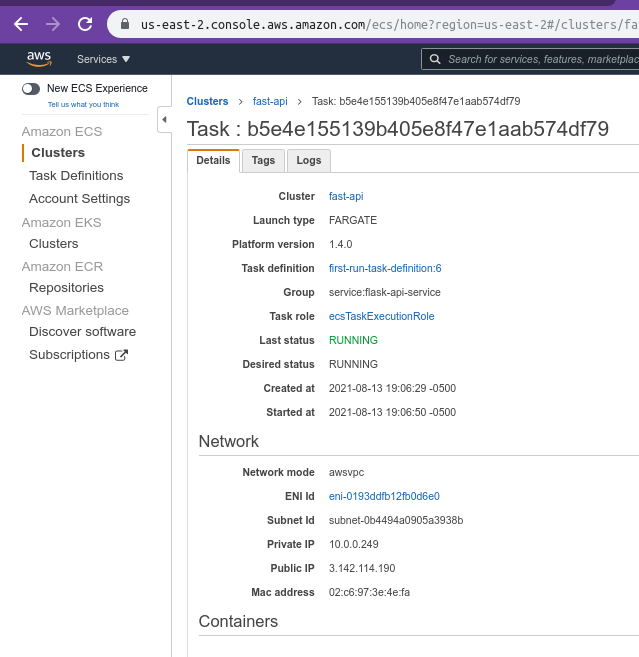

## TEXT CLASSIFICATION MODEL

This project is based on the [IMDB dataset](https://www.tensorflow.org/api_docs/python/tf/keras/datasets/imdb) that contains reviews from movies. Basically the final goal of this project is to predict if a review is positive o negative.

The package used is [Tensorflow](https://www.tensorflow.org/).

In this project, the input consists of sentences and the labels to predict are either 0 or 1.

It was chose to represent the text as embedding vectors and also a pre-trained text embedding model from [TensorFlow](https://tfhub.dev/) Hub was used: [nnlm-en-dim50](https://tfhub.dev/google/nnlm-en-dim50/2)

The model was created with three layers:
1. First layer is a TensorFlow Hub layer which uses a pretrained model that create an embedding vector from a sentence.
2. The second layer has 16 hidden units.
3. The last layer has one output node.

```
Model: "sequential"
_________________________________________________________________
Layer (type)                 Output Shape              Param #   
=================================================================
keras_layer (KerasLayer)     (None, 50)                48190600  
_________________________________________________________________
dense (Dense)                (None, 16)                816       
_________________________________________________________________
dense_1 (Dense)              (None, 1)                 17        
=================================================================
Total params: 48,191,433
Trainable params: 48,191,433
Non-trainable params: 0
```

After the model was trained, it's saved to use it later in the prediction endpoint.

## DEPLOYMENT

This application was deployed using [ECS](https://aws.amazon.com/ecs/?whats-new-cards.sort-by=item.additionalFields.postDateTime&whats-new-cards.sort-order=desc&ecs-blogs.sort-by=item.additionalFields.createdDate&ecs-blogs.sort-order=desc)

First steps, docker image was created and uploaded to [ECR](https://aws.amazon.com/ecr/).


Then an ECS cluster was created taking as a base image the docker image pushed previously to ECR.


The ECS creates a task which is the part that has the external IP (the IP changes in every deploy) where the Flask API is exposed.



## PRODUCTION TESTS

The following pictures are from the requests to the prediction endpoint deployed.

The reviews examples were taken from the dataset. At the bottom we have the prediction given the review provided.


## CI/CD

- Github actions
- CodeBuild
- Github workflow

The function of the Github actions is to implement CI/CD for projects. For this project, the option used was *Deploy to Amazon ECS* and all the settings are in `.github/workflows/aws.yml`. The pipeline of the CD is the following:

* AWS credentials configuration.
* Log in to ECR in order to update the existing docker image.
* Insert a new container image into an ECS task.
* Register a new ECS task and deploy it to Amazon ECS service.


After finishing all these tasks, our new code should be available.


*CodeBuild* is used every time there is a commit to `master` branch and triggers the building process of the application.


Combining *Github actions and CodeBuild* we have a full CI/CD, implementation of the project.
